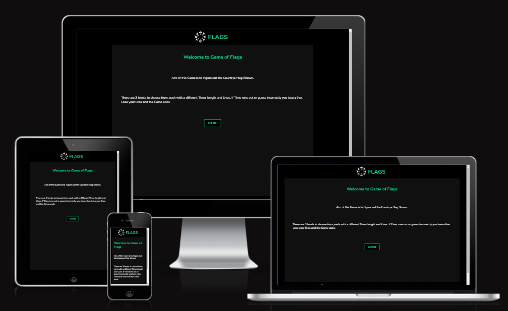
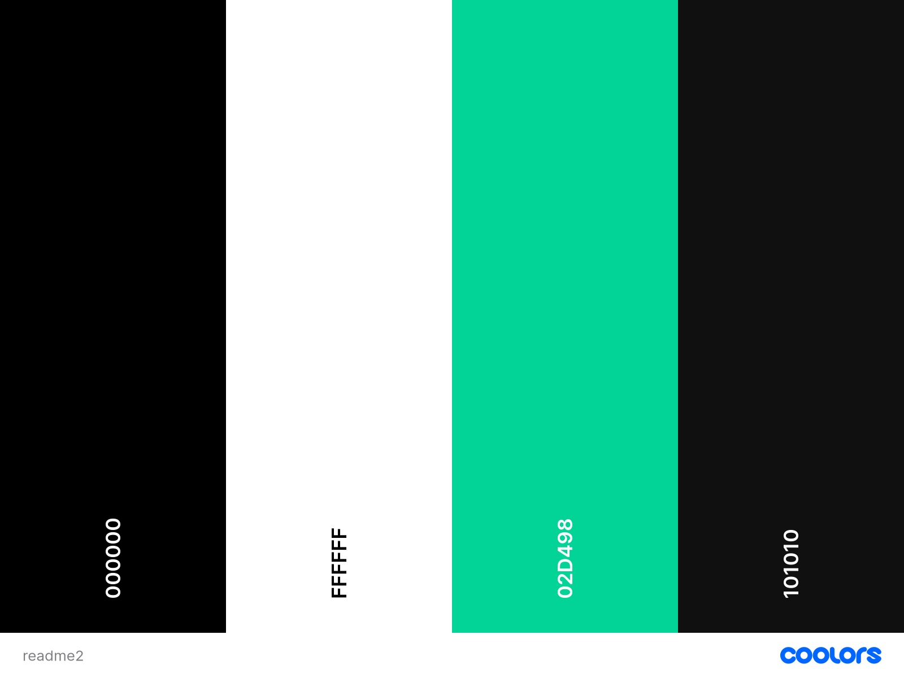
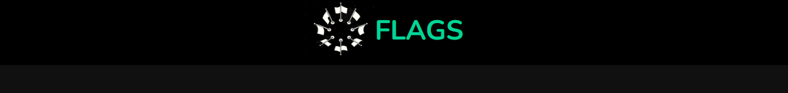
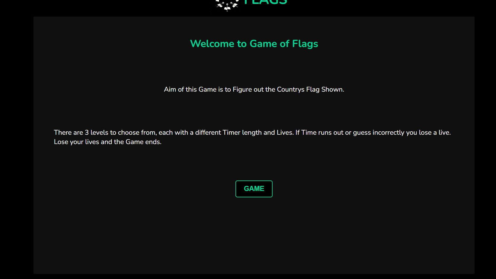
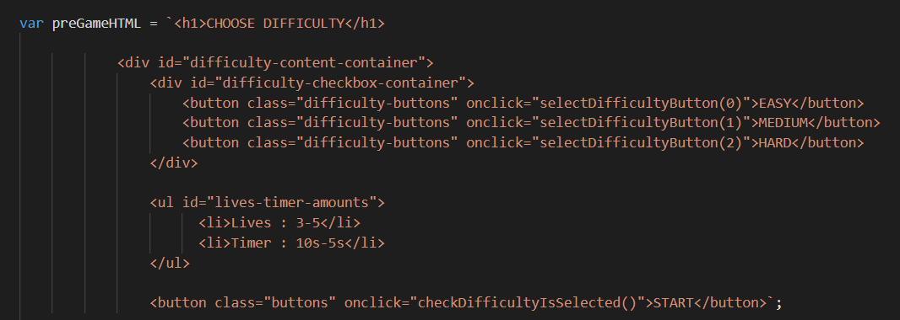
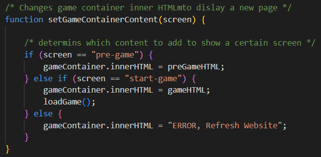
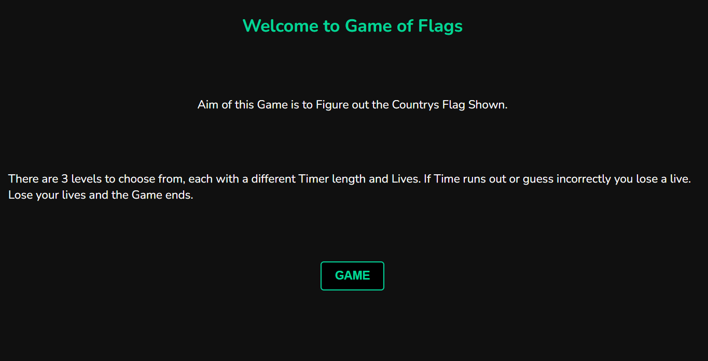
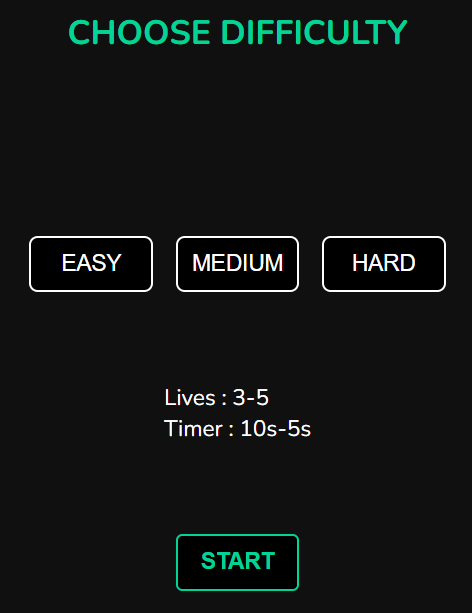
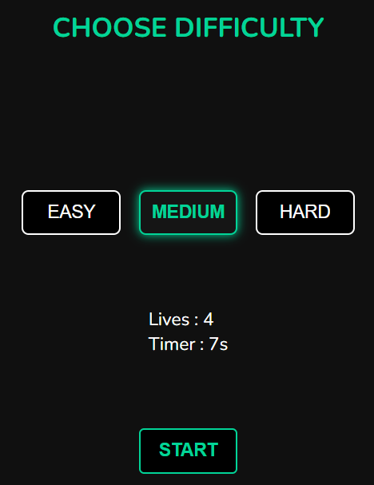
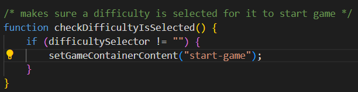

# FLAGS
Flags website is a method to learn all the countrys flags in a fun and challenging way. This for people who dont want to learn them a boring way and wants to at least enjoy learning this new skill to recognize any countrys flag.

Link to the [Live Website](https://haashimh1.github.io/Deploma2/)

## Design
### Colour Scheme

- Black, white as main colours for good contrast between content and background.
- Emeraldish colour as an accent to give better identity to important elements  
- Slightly lighter shade of black as the game container background.
### Structure : Website split into 3 parts
- Header
  
  - Minimal design and content as it does serve much of purpose, only to hold the logo of the page and the tite.
- Main
  - Most important part as this is where the game container is held. 

  - Black background with white text since I want to have a very dark background for game container to provide consistency with website colour scheme, but also a slighly lighter shade of black to give some contrast between the content and its background.
- Footer

  - Again a minimal design to match the header as this aswell does not serve much of a purpose, only to hold a link ti my GitHub profile and my name for Author.

## Game Breakdown
This is a one page Website, therefore the game containers inner HTML content is changed to give an effect of travelling to a new page. The game is split into 4 pages :

- Home : Breakdown of the game.
- Pre Game : Select the difficulty.
- Game : Playing the game.
- Post game : Shows score and restart option.

Each page with a button to go to next page (Post game's restart button goes to Pre Game instead incase user wants to change the difficulty). Buttons will call the same function on click but with different arguements, which will asign the inner HTML contents of the game container to a respective Global variable which holds the HTML for that certain page. Example of one of those Global variables and the function :

- Home Page Breakdown

  - Short breakdown of the game and button to next page with the accent colours to signify its importance.

- Pre Game Breadown
-  
  - Buttons to select the difficulty and showcases the lives and timer amount for each. On difficulty button click a class of styles are added in a transition to show the importance of choosing your set difficulty, also updates a global variable set the difficulty currently chosen. Below is the function that makes sure a difficulty is chosen when start button is clicked.
  - 
  - difficulty var is set to empty string as default, to show one is not selected.

- Gameplay breakdown
- Post Game breakdown

