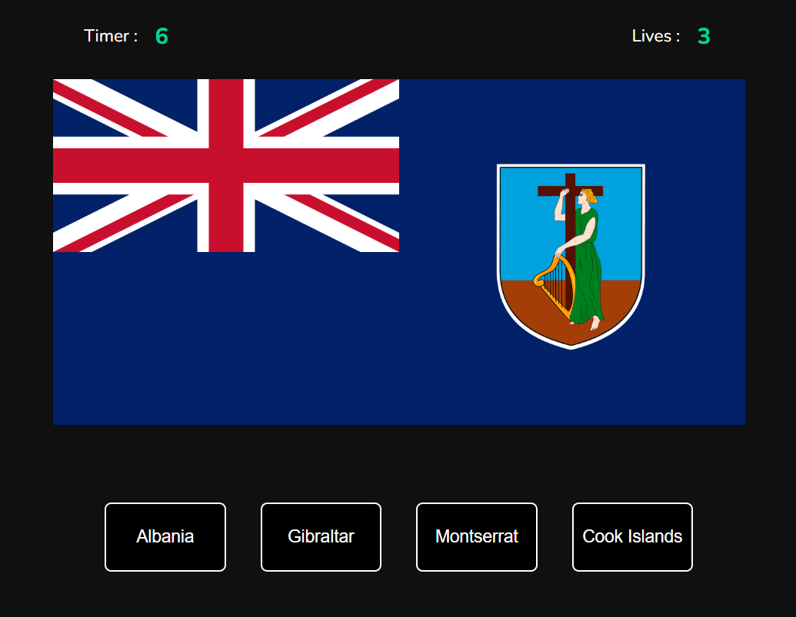
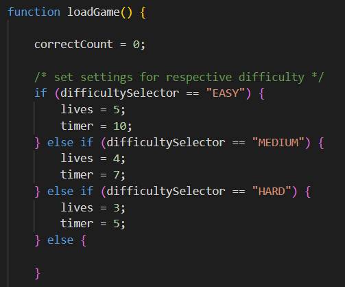
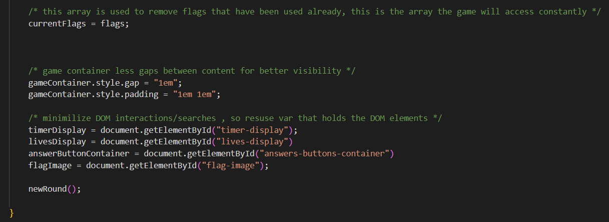
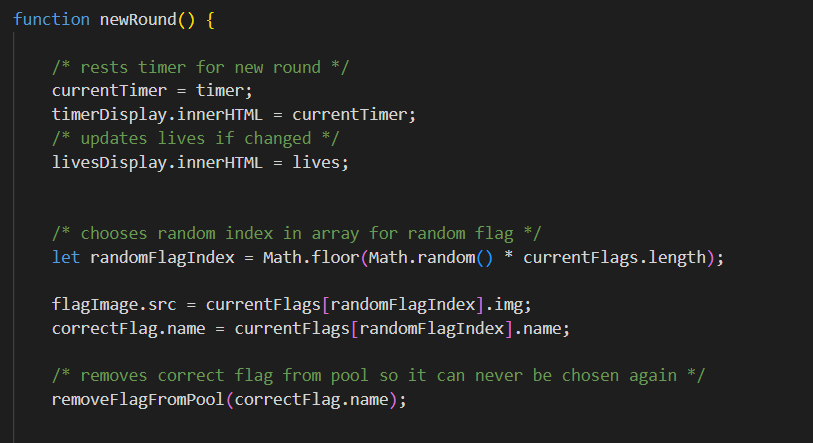
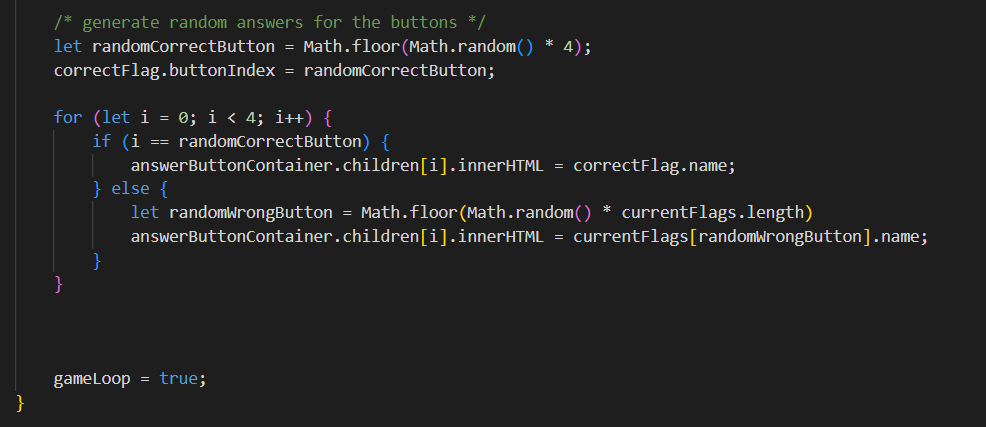
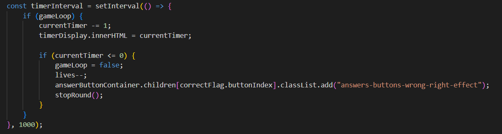
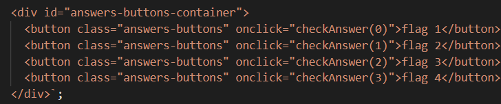
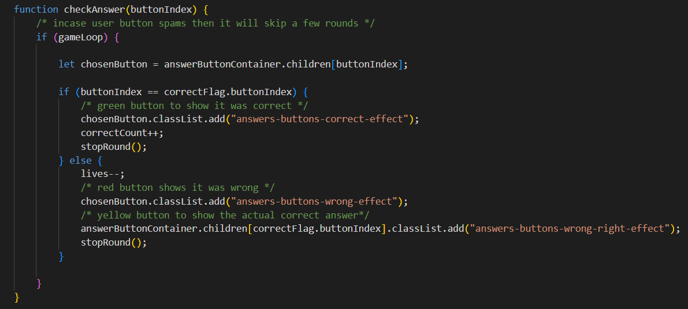

# FLAGS
Flags website is a method to learn all the countrys flags in a fun and challenging way. This for people who dont want to learn them a boring way and wants to at least enjoy learning this new skill to recognize any countrys flag.

Link to the [Live Website](https://haashimh1.github.io/Deploma2/)

## Design
### Colour Scheme

- Black, white as main colours for good contrast between content and background.
- Emeraldish colour as an accent to give better identity to important elements  
- Slightly lighter shade of black as the game container background.
### Structure : Website split into 3 parts
- Header
  
  - Minimal design and content as it does serve much of purpose, only to hold the logo of the page and the tite.
- Main
  - Most important part as this is where the game container is held. 

  - Black background with white text since I want to have a very dark background for game container to provide consistency with website colour scheme, but also a slighly lighter shade of black to give some contrast between the content and its background.
- Footer

  - Again a minimal design to match the header as this aswell does not serve much of a purpose, only to hold a link ti my GitHub profile and my name for Author.

## Game Breakdown
This is a one page Website, therefore the game containers inner HTML content is changed to give an effect of travelling to a new page. The game is split into 4 pages :

- Home : Breakdown of the game.
- Pre Game : Select the difficulty.
- Game : Playing the game.
- Post game : Shows score and restart option.

Each page with a button to go to next page (Post game's restart button goes to Pre Game instead incase user wants to change the difficulty). Buttons will call the same function on click but with different arguements, which will asign the inner HTML contents of the game container to a respective Global variable which holds the HTML for that certain page. Example of one of those Global variables and the function :

- Home Page Breakdown

  - Short breakdown of the game and button to next page with the accent colours to signify its importance.

- Pre Game Breadown
-  
  - Buttons to select the difficulty and showcases the lives and timer amount for each. On difficulty button click a class of styles are added in a transition to show the importance of choosing your set difficulty, also updates a global variable set the difficulty currently chosen. Below is the function that makes sure a difficulty is chosen when start button is clicked.
  - 
  - difficulty selector is set to empty string as default, to show one is not selected.

- Gameplay breakdown
-  
  - Gameplay consists of a country flg, 4 buttons to choose answer from and a display showing the remaining lives and timer. Before further breakdown, below is a table showing all global variables used and what it holds. All of these are blobal since it needs to be manipulated in multiple different functions.

    - | Vaiable Name     | Justification |
      |----------        |     ----------|
      | flags (const)    |Array of 250 objects, each holding a countrys name and a path link to its flags image file|
      | currentFlags    | Array of 250 objects, on new game it is asigned to flags (variable above) so that every flag chosen is then taken out this array, so game changes only affect this array and not the original above so that on game restart it can be reasigned to the original array holding all the flags again.|
      | difficultySelector    | String to hold the difficulty slected in pre game screen|
      | lives    | Integer to hold the lives left|
      | timer    | Integer to hold the start timer for each round|
      | currentTimer    | Integer to hold the time left in each round|
      | correctFlag    | Object holding the name of country chosen and its buttons index that it is in|
      | gameLoop    | Boolean to show if the game loop is on or off, an example of its use case is that timer only ticks down if game loop is on, otherwise it will count down below 0|
      | correctCount    | Intager to show how many correct answers the user has got|
      | gameContainer, timerDisplay, livesDisplay, answerButtonContainer, flagImage    | All are DOM Elements, these are global since we want to minimize the DOM searches as this is an intense task so all these are declared global and initialized when a game starts so it can manipluate the DOM with least searches.|
    
  - When the screen is changed to Game play, the function is called below to initialize some variables and set the game up.
    -  
      - First it resets correctCount to 0 incase the game was just restarted, then it initilizes the lives and timer variables repective to the difficulty chosen.
    -  
      - currentFlags is then asigned to the cont flags to reset the array incase game was restarted, game container style changes to better fit the new screen and the initialization of the DOM element variables that will be manipluated throughout the game (Note the gameContainer was initialized in a different function on Window Load up since this element was also maniplauted in previous screens) then newRound function is called to setup the new round.
  

  - New Round setup.
    -  
      - First is sets and updates the timer display to the start timer, updates the lives display to show the lives left, then chooses a random flag from currentFlags to be chosen as the correct answer, image source is updated to show the chosen flag, correctFlags is then asigned the name of the country chosen for future manipluation, then the flag chosen is then removed from the array so it is not chosen again for that game.
    - 
      - Then the button holding the correct answer is randomized then asgined to correct flags' button index for future manipulation, then the rest of the buttons are randomized with wrong answers. Finnalt the gameLoop is set to true, this is done at the end so that the timer ticks only when the previous setup is done for fairness to user.

  - At this point in the program the round is fully setup, there is no functions running in the background apart from the time ticking function shown below.
    - 
      - This function is called using setInterval every 1000ms (1 second) to update the timer accordingly.

  - Button is clicked to reveal answer
    - 
      - In the HTML, the onclick attribute is used to call the function checkAnswer with its index as arguements.
    - 
      - In the HTML, the onclick attribute is used to call the function checkAnswer with its index as arguements.
    

- Post Game breakdown

